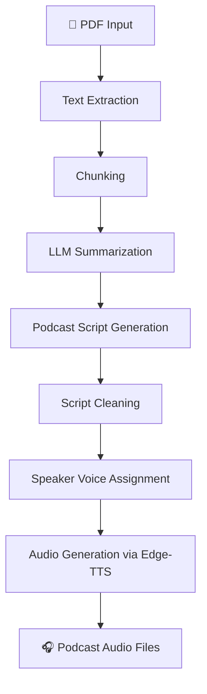

<div align="center">

# 🎙️ Listenify

### AI Research Paper → Podcast Generator

[](https://github.com/KESABA-BARIK/Listenify)
[](https://github.com/KESABA-BARIK/Listenify)
[](https://github.com/KESABA-BARIK/Listenify/issues)
[](https://www.python.org/)
[](LICENSE)

**Turn dense research papers into engaging AI-generated podcast conversations.**

Listenify reads a PDF, summarizes it using LLMs, generates a natural Host–Expert style dialogue, and converts it to speech — all automatically.


</div>

---

## ✨ Features

| Feature | Status |
|---|---|
| Extract text from research paper PDFs | ✅ |
| Automatically split large documents into chunks | ✅ |
| Summarize chunks using LLMs | ✅ |
| Generate Host–Expert style podcast scripts | ✅ |
| Produce realistic AI-voiced audio | ✅ |
| Supports **Groq** and **OpenRouter** APIs | ✅ |

---

## 🧠 How It Works



---

## 🗂️ Project Structure

```
Listenify/
│
├── main.py                  # FastAPI app & pipeline entry point
├── summarize_service.py            # LLM-based chunked summarization
├── podcast_service.py     # Converts summaries to podcast script
├── tts_engine.py                   # Text-to-speech via Edge-TTS
├── pdf_extractor.py               # Extracts pdf content
├──audio_merger.py          #merges audio files
│
├── output/
│   └── audio/
│
└── README.md
```

---

## ⚡ Quick Start

### 1. Clone & Install

```bash
git clone https://github.com/KESABA-BARIK/Listenify.git
cd Listenify
pip install -r requirements.txt
```

### 2. Configure API Keys

Create a `.env` file in the project root:

```env
GROQ_API_KEY=your_groq_api_key
OPENROUTER_API_KEY=your_openrouter_api_key
```

### 3. Run the Server

```bash
uvicorn main:app --reload
```

### 4. Upload Your PDF

Place your research paper at:

```
POST: http://127.0.0.1:8000/upload
```

Listenify will automatically:

1. Extract text from the PDF
2. Chunk and summarize it using an LLM
3. Generate a Host–Expert podcast script
4. Convert each dialogue line to speech
5. Save all audio files to `/audiobooks/`

---

## 🗣️ Voices

| Role | Voice |
|---|---|
| 🎙️ Host | `en-US-GuyNeural` |
| 🧑‍🔬 Expert | `en-US-JennyNeural` |

---

## 📦 Requirements

```
groq
edge-tts
pypdf
python-dotenv
tqdm
fastapi
uvicorn
```


---

## ⚠️ Known Limitations

- Summaries may condense or omit fine-grained details from the original paper.
- Audio is generated per dialogue line, resulting in multiple small files rather than one continuous episode.
- LLM output occasionally requires post-processing to clean up script formatting.
- Very large PDFs may require more aggressive chunking configuration.

---

## 🔮 Roadmap

| Feature | Priority |
|---|---|
| Hierarchical summarization for better coverage | ⭐⭐⭐ |
| Merge audio files into a single episode | ⭐⭐⭐ |
| Web interface for PDF upload & playback | ⭐⭐⭐ |
| Support for more speakers and voice roles | ⭐⭐ |
| Auto-generated podcast title & description | ⭐⭐ |
| Automatic cover art generation | ⭐⭐ |
| Background music & intro/outro segments | ⭐ |
| Spotify / RSS feed export | ⭐ |

---

## 📚 Example Use Cases

- 🔬 Quickly digest research papers as audio summaries
- 🎓 Learn complex topics in a conversational format
- 🎙️ Create podcast content from academic literature
- 📖 Accelerate literature reviews

---

## 🤝 Contributing

Contributions are welcome! Here's how to get started:

1. Fork the repository
2. Create a feature branch: `git checkout -b feature/your-feature`
3. Commit your changes: `git commit -m 'Add your feature'`
4. Push to your branch: `git push origin feature/your-feature`
5. Open a Pull Request

For significant changes, please open an issue first to discuss your idea.

---

## 🙏 Acknowledgments

- [Groq](https://groq.com) — Fast LLM inference
- [OpenRouter](https://openrouter.ai) — LLM API aggregation
- [Microsoft Edge TTS](https://github.com/rany2/edge-tts) — Neural voice synthesis

---

## 📄 License

This project is licensed under the [MIT License](LICENSE).

---

<div align="center">

Made with ❤️ by [KESABA-BARIK](https://github.com/KESABA-BARIK)

</div>