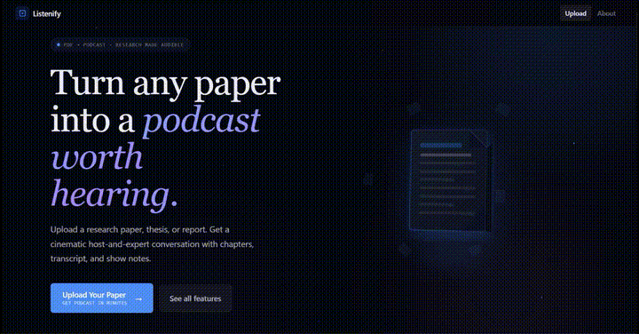

<div align="center">

<br />

```
    ██╗     ██╗███████╗████████╗███████╗███╗   ██╗██╗███████╗██╗   ██╗
    ██║     ██║██╔════╝╚══██╔══╝██╔════╝████╗  ██║██║██╔════╝╚██╗ ██╔╝
    ██║     ██║███████╗   ██║   █████╗  ██╔██╗ ██║██║█████╗   ╚████╔╝ 
    ██║     ██║╚════██║   ██║   ██╔══╝  ██║╚██╗██║██║██╔══╝    ╚██╔╝  
    ███████╗██║███████║   ██║   ███████╗██║ ╚████║██║██║        ██║   
    ╚══════╝╚═╝╚══════╝   ╚═╝   ╚══════╝╚═╝  ╚═══╝╚═╝╚═╝        ╚═╝   
```

**Turn any research paper into a podcast worth hearing.**

Upload a PDF. Get a host-and-expert conversation — with chapters, transcript, quiz, mind map, and more.

<br />

[](https://listenify-frontend.vercel.app/)
[](https://github.com/KESABA-BARIK/Listenify/stargazers)
[](https://github.com/KESABA-BARIK/Listenify/network)
[](./LICENSE)
[](https://python.org)
[](https://nextjs.org)
[](https://fastapi.tiangolo.com)

</div>

<br />

---

## Why Listenify

Most people skim research papers instead of reading them. Dense abstracts, jargon-heavy methods, walls of citations — it compounds fast. Listenify gives you a first pass that actually sticks.

A 15-minute host-and-expert conversation before you dive into the full paper changes how much you understand and retain. This isn't text-to-speech. It's a structured dialogue where a curious host asks the right questions and a domain expert explains the findings — clearly, conversationally, and in your language.

---

## Demo

> **[listenify-frontend.vercel.app](https://listenify-frontend.vercel.app/)**

<!--
  Replace the SVG below with your actual demo GIF once recorded.
  Recommended flow to capture: upload PDF → generation progress → playback with
  live transcript highlighting → quiz panel → mind map.

  Save it as ./assets/demo.gif then swap in:
  
-->

<div align="center">



<br/>

[Watch full demo video](https://github.com/KESABA-BARIK/Listenify/raw/main/assets/out.mp4)

</div>

---

## Features

### Core podcast engine

| Feature | Details |
|---|---|
| **PDF & URL ingestion** | Upload a research PDF or paste an arXiv / DOI link directly |
| **Host–Expert dialogue** | Two-voice conversational script generated by LLaMA 3.1 — not a dry summary |
| **Neural text-to-speech** | Microsoft Edge TTS renders each speaker with a distinct voice |
| **Chapter markers** | AI-generated chapter titles from your content; jump to any section instantly |
| **Full transcript** | Speaker-labelled, timestamped, downloadable as plain text |
| **Show notes** | Key terms defined, main findings summarised, ready to copy anywhere |

### Interactive learning suite

| Feature | Details |
|---|---|
| **Real-time script highlighting** | Transcript highlights word-by-word as audio plays |
| **Quiz mode** | Comprehension quiz auto-generated from the paper; regenerate for a fresh set |
| **Ask AI** | Ask any follow-up question about the paper, answered in context by the LLM |
| **Mind map** | Visual knowledge graph of core concepts, relationships, and findings |
| **Debate mode** | Host challenges the expert — probes limitations, plays devil's advocate |

### Reach & accessibility

| Feature | Details |
|---|---|
| **8 languages** | English, Tamil, Hindi, Spanish, French, German, Arabic, Telugu |
| **Difficulty dial** | Plain introduction for newcomers through to expert-level technical discussion |
| **Three length modes** | Brief (~5 min), Standard (~15 min), Full (complete paper coverage) |
| **Chrome Extension** | Convert papers directly from your browser without switching tabs |

---

## How it works

```
PDF / URL
    │
    ▼
┌───────────────────┐
│  Text extraction  │  PyMuPDF strips and cleans text from every page
└─────────┬─────────┘
          │
          ▼
┌───────────────────┐
│  Chunking &       │  Large papers split into overlapping chunks
│  summarisation    │  Each chunk summarised independently by LLaMA 3.1
└─────────┬─────────┘
          │
          ▼
┌───────────────────┐
│  Script           │  Host–Expert dialogue constructed from summaries
│  generation       │  Chapters, probing questions, and explanations woven in
└─────────┬─────────┘
          │
          ├──────────────────────────────────────────────────────┐
          ▼                                                      ▼
┌───────────────────┐                               ┌───────────────────────┐
│  Audio synthesis  │  Edge TTS renders each        │  Learning suite       │
│  & merging        │  speaker line; files merged   │  Quiz / Ask AI /      │
└─────────┬─────────┘  into one episode             │  Mind map generation  │
          │                                          └───────────────────────┘
          ▼
  Podcast episode
  + transcript + show notes + chapters
```

---

## Quick start

### Prerequisites

- Python 3.8+
- Node.js 18+
- [Groq API key](https://console.groq.com/) — free tier is sufficient
- [OpenRouter API key](https://openrouter.ai/) — optional fallback

### 1. Clone

```bash
git clone https://github.com/KESABA-BARIK/Listenify.git
cd Listenify
```

### 2. Backend

```bash
pip install -r requirements.txt
cp .env.example .env
```

Edit `.env`:

```env
GROQ_API_KEY=your_groq_api_key_here
OPENROUTER_API_KEY=your_openrouter_api_key_here   # optional
REDIS_URL=redis://localhost:6379                   # optional, enables caching
```

```bash
uvicorn main:app --reload --port 8000
```

The API is live at `http://localhost:8000`. Visit `/docs` for the interactive Swagger UI.

### 3. Frontend

```bash
cd listenify-frontend
npm install
cp .env.local.example .env.local
```

Edit `.env.local`:

```env
NEXT_PUBLIC_API_URL=http://localhost:8000
```

```bash
npm run dev
```

Open [http://localhost:3000](http://localhost:3000).

### 4. Generate your first podcast

1. Upload a research paper PDF or paste an arXiv URL
2. Choose **Language**, **Depth**, and **Length**
3. Enable **Debate Mode** if you want critical discussion
4. Hit **Generate** — episode is ready in under 2 minutes
5. Play, follow the live transcript, take the quiz, or explore the mind map

---

## Project structure

```
Listenify/
│
├── main.py                  # FastAPI app — pipeline orchestration
├── pdf_extractor.py         # Text extraction via PyMuPDF
├── url_extractor.py         # Fetch PDFs from arXiv / DOI URLs
├── summary_service.py       # LLM-based chunked summarisation
├── transcript_service.py    # Script formatting and clean-up
├── podcast_service.py       # Host–Expert dialogue construction
├── tts_engine.py            # Edge TTS voice synthesis
├── audio_merger.py          # Merges per-line audio into a single episode
├── chapter_service.py       # AI chapter title generation
├── show_notes_service.py    # Show notes and key term definitions
├── quiz_service.py          # Comprehension quiz generation
├── QA_service.py            # Ask AI — contextual Q&A on paper content
├── mind_map_service.py      # Concept graph generation
├── language_config.py       # Multi-language voice and prompt config
├── requirements.txt
├── render.yaml              # Render deployment config
├── runtime.txt
│
└── listenify-frontend/
    ├── app/                 # Next.js 14 App Router
    ├── components/          # UI components
    ├── public/
    └── package.json
```

---

## Tech stack

**Backend**

| Layer | Technology | Role |
|---|---|---|
| API | [FastAPI](https://fastapi.tiangolo.com) | REST endpoints, async request handling |
| LLM | [Groq / LLaMA 3.1](https://groq.com) | Script, quiz, Q&A, and mind map generation |
| LLM fallback | [OpenRouter](https://openrouter.ai) | Model flexibility and routing |
| TTS | [Microsoft Edge TTS](https://github.com/rany2/edge-tts) | Neural voice synthesis |
| PDF | [PyMuPDF](https://pymupdf.readthedocs.io) | Text extraction |
| Cache | [Redis](https://redis.io) | Session state and generation caching |
| Hosting | [Render](https://render.com) | Backend deployment |

**Frontend**

| Layer | Technology | Role |
|---|---|---|
| Framework | [Next.js 14](https://nextjs.org) | App Router, SSR |
| Styling | [Tailwind CSS](https://tailwindcss.com) | Utility-first styling |
| Language | [TypeScript](https://typescriptlang.org) | Type-safe frontend |
| Hosting | [Vercel](https://vercel.com) | Frontend deployment and edge CDN |
| Extension | Chrome Extension | Browser-native paper conversion |

---

## Supported languages

| Language | Code | Host voice | Expert voice |
|---|---|---|---|
| English | `en` | `en-US-GuyNeural` | `en-US-JennyNeural` |
| Tamil | `ta` | `ta-IN-ValluvarNeural` | `ta-IN-PallaviNeural` |
| Hindi | `hi` | `hi-IN-MadhurNeural` | `hi-IN-SwaraNeural` |
| Spanish | `es` | `es-ES-AlvaroNeural` | `es-ES-ElviraNeural` |
| French | `fr` | `fr-FR-HenriNeural` | `fr-FR-DeniseNeural` |
| German | `de` | `de-DE-ConradNeural` | `de-DE-KatjaNeural` |
| Arabic | `ar` | `ar-SA-HamedNeural` | `ar-SA-ZariyahNeural` |
| Telugu | `te` | `te-IN-MohanNeural` | `te-IN-ShrutiNeural` |

Indic language support (Tamil, Hindi, Telugu) makes Listenify one of the few research tools in this space accessible to over 1.5 billion native speakers.

---

## Roadmap

**In progress**

| Feature | Notes |
|---|---|
| Chrome Extension — public release | Finishing browser detection and one-click convert flow |
| Mobile playback improvements | Better scrubbing and transcript sync on small screens |

**Planned**

| Feature | Notes |
|---|---|
| arXiv & Semantic Scholar integration | Direct URL-to-podcast without manual PDF download |
| Podcast library per user | Browse and replay past generations |
| Background music + intro/outro | Optional audio polish layer |
| Multi-paper comparison episodes | Host compares two papers side-by-side |

**Exploring**

| Feature | Notes |
|---|---|
| RSS feed export | Subscribe to your generated library in any podcast app |
| Spotify / Apple Podcasts publishing | One-click distribution |
| Collaborative transcript annotations | Highlight and comment with teammates |
| Custom voice for host and expert | Bring your own TTS voice profile |

---

## Contributing

All contributions welcome — bug fixes, new languages, features, documentation.

```bash
# Fork, then clone your fork
git clone https://github.com/YOUR_USERNAME/Listenify.git

# Create a branch
git checkout -b feat/your-feature-name

# Commit using conventional commits
git commit -m "feat: add Telugu language config"

# Push and open a PR against main
git push origin feat/your-feature-name
```

**Guidelines**

- Bug fixes: open an issue first to confirm the problem, then submit a PR
- New features: open an issue to discuss before building
- New languages: add voice config in `language_config.py` and open a PR
- Tests and docs: always welcome, no issue needed

**Commit convention** — we use [Conventional Commits](https://www.conventionalcommits.org/):

```
feat: add debate mode for Hindi
fix: resolve audio merge timing offset
docs: add language config instructions
refactor: simplify chunk summarisation pipeline
```

---

## Known limitations

- Very large PDFs (50+ pages) may need chunking config tuning for best results
- LLM output occasionally requires post-processing to fix script formatting edge cases
- TTS voices can mispronounce highly technical acronyms or chemical nomenclature
- Debate mode works best on papers with clearly stated claims or contested findings

---

## Acknowledgments

| Project | Role |
|---|---|
| [Groq](https://groq.com) | Fast LLM inference powering all AI generation |
| [Meta LLaMA 3.1](https://llama.meta.com) | Base model for script, quiz, and Q&A |
| [Microsoft Edge TTS](https://github.com/rany2/edge-tts) | Neural voice synthesis across 8 languages |
| [PyMuPDF](https://pymupdf.readthedocs.io) | Reliable PDF text extraction |
| [OpenRouter](https://openrouter.ai) | Model flexibility and fallback routing |
| [FastAPI](https://fastapi.tiangolo.com) | High-performance Python API framework |
| [Next.js](https://nextjs.org) | Frontend framework |
| [Redis](https://redis.io) | Session state and generation caching |

---

## License

MIT — see [LICENSE](./LICENSE) for details. Free to use, modify, and distribute with attribution.

---

<div align="center">

Built by [KESABA-BARIK](https://github.com/KESABA-BARIK)

If Listenify saved you hours of reading, a star on GitHub helps others find it.

[](https://github.com/KESABA-BARIK/Listenify)
[](https://listenify-frontend.vercel.app/)

</div>